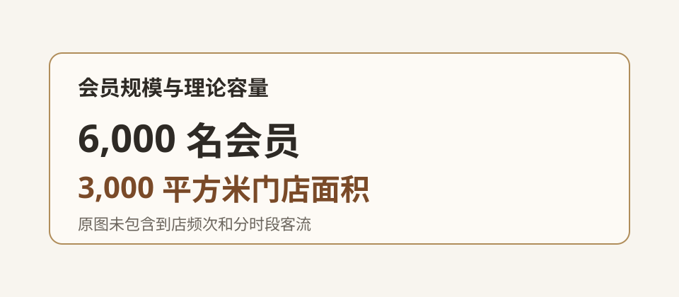

# 会员规模与门店容量

## 摘要

会员规模决定订阅收入基础，门店面积决定可同时服务人数。现有资料尚未提供会员到店频次和分时段客流，因此无法进一步判断高峰容量。

## 4　会员规模

样本门店共有 6,000 名会员，门店面积为 3,000 平方米。会员数量明显高于场地可以同时容纳的人数，但实际使用压力取决于到店频次。

## 5　门店容量

目前只能根据会员数和面积描述理论容量，尚无证据判断一天中的高峰时段，也无法说明活跃会员与全部会员的使用频次差异。

**图 2　会员规模与理论容量**

图中只呈现会员总数和门店面积，不包含到店频次或分时段客流。

## 结论

现有数据支持会员存量与场地面积的静态比较，不能进一步判断实际到店压力和高峰资源配置。
